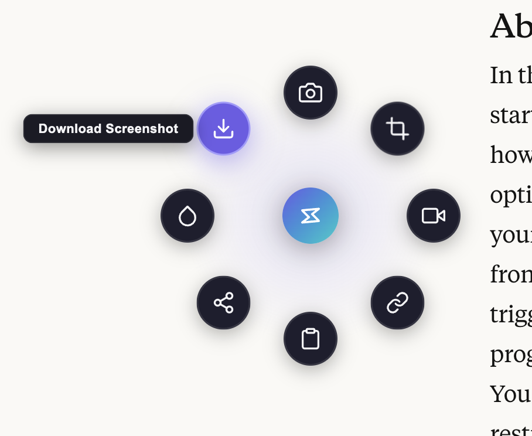

# Snap Tools

A Chrome extension that adds a floating circular menu to every webpage with quick-access tools for screen capture, recording, URL sharing, and more.

## Screenshots

<p align="center">
  
</p>

## Features

| Tool | What it does |
|------|-------------|
| **Screenshot** | Captures the visible tab and copies the PNG to your clipboard — paste it directly into Slack, email, docs, etc. |
| **Area Capture** | Drag to select a specific region of the page. The cropped screenshot is copied to your clipboard. Shows live dimensions while selecting. |
| **Record Screen** | Records your screen, window, or tab as a `.webm` video. Starts with a 3-second countdown. The recording is copied to clipboard when stopped (falls back to file download if clipboard isn't supported). |
| **Copy URL** | Copies the current page URL to your clipboard. |
| **Copy Title + URL** | Copies both the page title and URL as formatted text. |
| **Share Page** | Uses the native Web Share API if available, otherwise copies a shareable link to clipboard. |
| **Color Picker** | Opens the browser's EyeDropper tool to pick any color from the screen. Copies the hex code (e.g. `#6c5ce7`) to clipboard. |
| **Download Screenshot** | Captures the visible tab and saves it as a `.png` file. |

## How to Use

### The Floating Button

A small gradient circle (purple-to-teal with a bolt icon) appears in the bottom-right corner of every webpage.

- **Hover** over it to expand the radial menu
- **Click** it to toggle the menu open/closed
- **Drag** it to reposition anywhere on the page (position is saved per-site)
- Press **Escape** or click anywhere outside to close the menu

### Toolbar Icon

Click the Snap Tools icon in Chrome's toolbar to:
- Toggle the radial menu on pages where it's already loaded
- Inject the widget on pages where the content script didn't auto-load

### Screenshots & Recordings

The floating button automatically hides itself before any capture, so it never appears in your screenshots or recordings.

**Screenshots** are copied to your clipboard as PNG images — paste them directly into any app that accepts images (Slack, Discord, Google Docs, Figma, etc.).

**Recordings** are captured as `.webm` video and copied to clipboard when possible. If clipboard doesn't support video, the file is downloaded automatically.

## Installation

1. Clone or download this repository
2. Open `chrome://extensions/` in Chrome
3. Enable **Developer mode** (toggle in top-right)
4. Click **Load unpacked**
5. Select the `snap-tools` folder
6. The extension icon appears in your toolbar and the floating button appears on all web pages

## Project Structure

```
snap-tools/
├── manifest.json      # Extension manifest (MV3)
├── background.js      # Service worker — handles tab capture and desktop recording
├── content.js         # Content script — floating button, radial menu, all UI
├── icons/
│   ├── icon16.png     # Toolbar icon
│   ├── icon48.png     # Extensions page icon
│   └── icon128.png    # Chrome Web Store icon
└── README.md
```

## Technical Details

- **Manifest V3** — uses service worker, `chrome.scripting`, and modern Chrome APIs
- **Shadow DOM** — the floating UI is rendered inside a Shadow DOM to prevent any CSS conflicts with the host page
- **Embedded CSS** — all styles are bundled inside `content.js` and injected into the shadow root, eliminating external CSS dependencies
- **No external libraries** — zero dependencies, pure vanilla JS
- **Permissions used:**
  - `activeTab` — temporary tab access when clicking the toolbar icon
  - `tabs` — query tab info for URL/title copy
  - `scripting` — programmatic content script injection as fallback
  - `desktopCapture` — screen/window/tab recording
  - `<all_urls>` (host permission) — required for `captureVisibleTab` to work from the floating menu

## Browser Support

- Google Chrome 110+
- Chromium-based browsers (Edge, Brave, Arc, etc.)
- The Color Picker requires Chrome 95+ (EyeDropper API)
